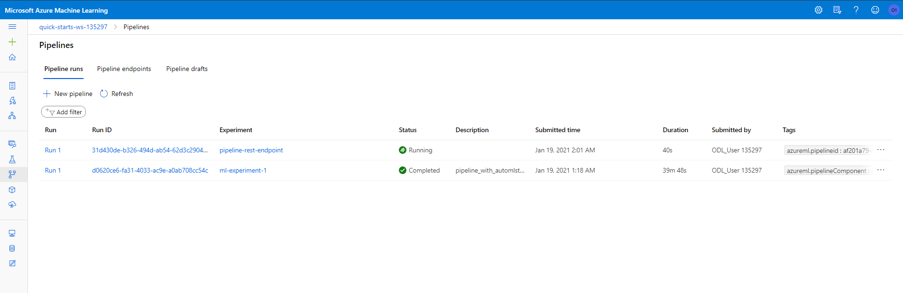

# Operationalizing Machine Learning

With this project, we are tasked to deploy and consume a machine Learning model on Microsoft Azure. We will be using the Azure ML Studio and the Python SDK to enable authentication, run an Auotmated ML experiment to train and deploy the best model. We will also enable Application Insight to monitor information about deployed service while consuming the model using RESTFul endpoint. Finally, we will create, publish and interact with a pipeline to automate the model deployment workflow. Published pipeline allows external services to inteact with the model. For this project, we will be using Bank Marketing Dataset, same as project 1.

## Architectural Diagram

Architecture diagram of the project and give an introduction of each step. An architectural diagram is an image that helps visualize the flow of operations from start to finish. In this case, it has to be related to the completed project, with its various stages that are critical to the overall flow. For example, one stage for managing models could be "using Automated ML to determine the best model".

## Key Steps

### 1. Enable Authentication:

- With this step, we will need to make sure to enable authentication which is crucial for the continuous flow of operations. Authentication Types supported by Azure ML are Key-based, Token-based and Interactive.
-  We will also need to create a Service Principal account and associate it with workspace to enable access of specific resource.
- **NOTE:** As we are using Azure Account configured by Udacity, we will not need to perform this step.

### 2. Automated ML Experiment:

After security is enabled, we will need to create a dataset in Azure Machine Learning Studio uploading Bank Marketing dataset (bankmarketing_train.csv) provided.

We will create and execute a new Auomated ML run by selecting above created dataset, configure new compute cluster for the run and select task type (classification) with additional configuration provided. 
	- Completed Automated ML run is shown as follows with best performing model with evaluation metrics is displayed under Best Model Summary tab.

Details of best performing model and performance metrics for configured AutoML run with provided dataset is the VotingEnsemble model with Accuracy `92.05%` is shown as follows.

Different algorithms used by each child run of Automated ML is as follows.

### 3. Deploy the Best Model:

In this step, we will deploy Best Performing Model identified from above step. Here, we need to **Enable Authentication** and set Compute Type as **Azure Container Instance (ACI)** upon deploying model.

Status of model deployment can be viewed under Assets -> Endpoints tag from Azure ML Studio shown as below.
 

### 4. Enable Logging (Application Insight):

In this step, we will need to enable logging to monitor health of deployed service in production/lower environments. To do so, we will enable **Application Insight** and retrieve logs from a deployed model.

Using provided script `logs.py` under `starter_code`, we will dynamically authenticate to Azure, enable Application Insights and Display logs for deployed model. Result of script execution is as follows.

Application Insights enabled for deployed model with dashboard URL available as follows.

Application Insights dashboard displaying multiple performance metrics for deployed service is as follows.

### 5. Swagger Documentation:

In this step, we will consume deployed RESTful web service in Azure ML Studio using Swagger. This is a multi step process performed as follows:
	1. Download Swagger JSON file for deployed model from Azure ML Studio.
	2. Using `swagger.sh` script, we will download latest Swagger container and host it on local computer.
	3. Using `serve.py` script, we will start hosting current directory content including `swagger.json` file.
	

To interact with deployed web service's API resources, change URL on Swagger UI to http://localhost:8000/swagger.json shown as follows.

HTTP API GET Operation

HTTP API POST Operation

HTTP API Response for POST Operation

Request and Response payload definition to interact with model endpoint

### 6. Consume Model Endpoints:

To consume/interact with deployed model, we will be using `endpoint.py` script modifying the `scoring_uri` with URI generated and the `key` to match the one from the service after deployment.
	- Response received from service after script execution is as follows.

#### 6.1 Benchmark the Endpoint:

- Using Apache Benchmark, we will be creating a baseline performance measure for deployed HTTP service.

- Execution result of provided `benchmark.sh` script shown as follows.

### 7. Create, Publish and Consume a Pipeline:

In this step, we will load `aml-pipelines-with-automated-machine-learning-step.ipynb` to the Azure ML Studio to perform multiple operations as follows:
	1. Initialize Workspace and create an Azure ML experiment.
	2. Create and attach AmlCompute cluster as a compute target for AutoML run.
	3. Load and Review dataset using Python SDK.
	4. Create Pipeline and AutoML Step using AuotML configuration and Pipeline Data (`metric_data` & `model_data`).
	5. Publish Pipeline to automate model training using AutoML step with provided dataset and configuration.
	6. Monitor pipeline step runs using RunDetails Widget.

Pipeline Section of Azure ML Studio showing pipelines created.

Pipeline Endpoint section under Pipeline tab on Azure ML Studio displaying Pipeline API service available to consume by externam applications.

Published Pipeline Overview screen displaying a REST endpoint and status of pipeline as Active.

Experiment with automl_module connected to BankMarketing Dataset is displayed with Best Performing model summary and Run Summary information.

Using Python SDK, monitor status of Pipeline execution using RunDetail Widget in Jupyter Notebook.

Scheduled pipeline run using Python SDK displaying in Azure ML Studio.

## Screen Recording
Screen Recording with detailed explanation uploaded and can be found using [Link](https://youtu.be/mCt8VI2WYgA)

## Standout Suggestions

-  According to Azure AutoML's Data Guardrails analysis, class immbalance is detected in the provided dataset for this project. Here, class distribution of sample space in the training dataset is severly disproportionated with non-subscription to subscription instance is 89:11. Because input data has a bias towards one class, this can lead to a falsely perceived positive effect of a model's accuracy. To improve accuracy of the prediction model, will use synthetic sampling techniques like SMOTE, MSMOTE and other ensemble techniques to increase the frequency of the minority class or decrease the frequncy of the majority class.
	- How upsampling improves performance of the model: Using oversampling techniques like SMOTE, minority class is over-sampled by taking each minority class sample and introducing synthetic examples to create large and less specific decision boundaries that increase the generalization capabilities of classifiers.

- Due to class imbalance problem we have with the given data set, it is possible that model will always only predict class which has higher % instances in the dataset. This results into excellent classification accuracy as it only reflects the underlying class distribution. This situation is called Accuracy Paradox, where accuracy is not the best metric to use for performance evaluation of prediction model and can be misleading. As a future improvements of this model, will use additional measures such as Precision, Recall, F1 Score etc. to evaluate a trained classifier.
	- How use of additional performance metrics help improve performance of the model: With highly imbalance dataset, chances while performing k-fold cross validation procedure in the training set is that single fold may not contain a positive sample, which results into True Positive Rate (TPR) and False Negtive Rate (FNR) to 0. We will choose ROC AUC over Accuracy as plot from the ROC curve will help understand trade-off in performance for different threshold values when interpreting probabilistic predictions. Changing the threshold of classification will change the balance of predictions towards improving the TPR at the expense of FPR and vice versa and so ROC analysis doesn't have any bias towards models which performs well on either minority or majority class, which is a helpful metric to deal with imbalance dataset.

- Enable `Deep Learning` option while configuring AutomatedML run, which will take more powerful models into consideration during multiple iterations and can come up with better performing model as a result.

- Use more data to score so that more accurate baseline performance measure can be created while Benchmarking the performance of the endpoint , currently we are only using 2 json requests with data in endpoint.py file to get results back from which can be increased to few hundreds of dummy requests to check if there is any performance bottleneck from deployed model's end while returning result.
